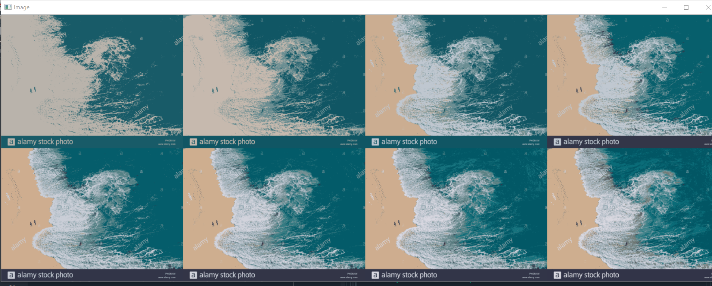

# Image Segmentation Using K-Means Clustering

Image segmentation is an important step in image processing, and it seems everywhere if we want to analyze what’s inside the image.

Image segmentation is the classification of an image into different groups. Many kinds of research have been done in the area of image segmentation using clustering. There are different methods and one of the most popular methods is K-Means clustering algorithm.

## Screenshots(Output)

#### Original Image-

 

#### After applying clustering on the image-

 

This consists 8 photos starting from top left K=1 to K=8. 

For different K we got different clusters.

## Author

Rahul Kumar Patro
